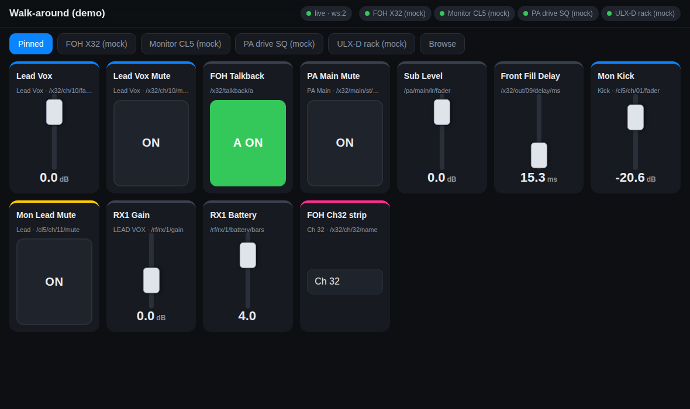
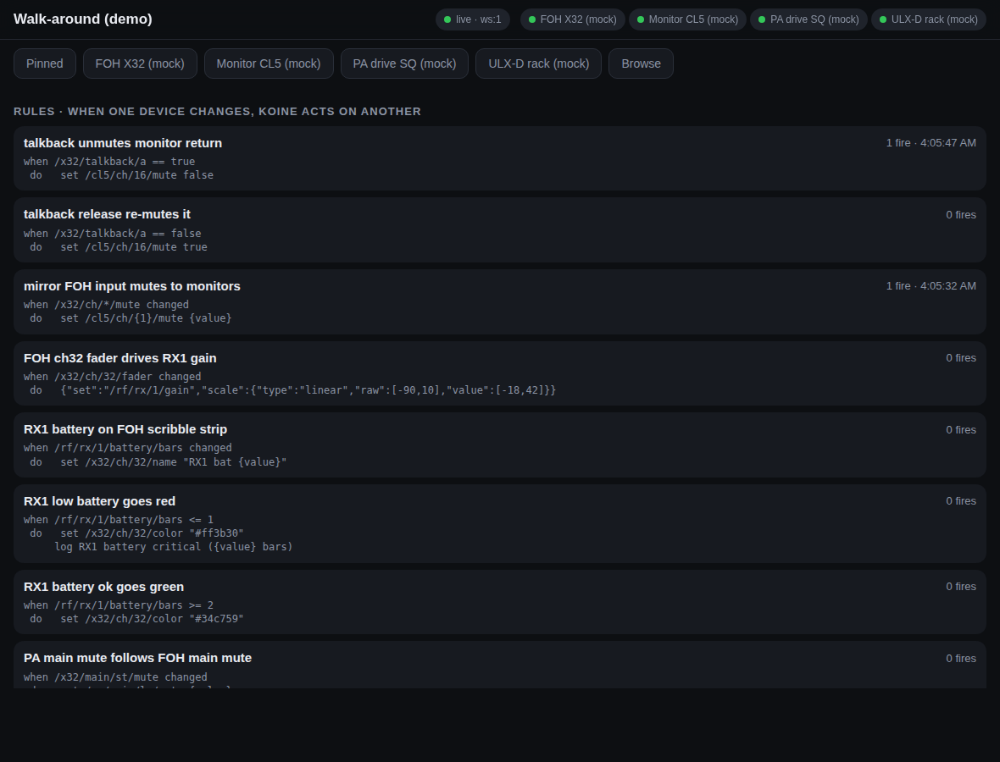
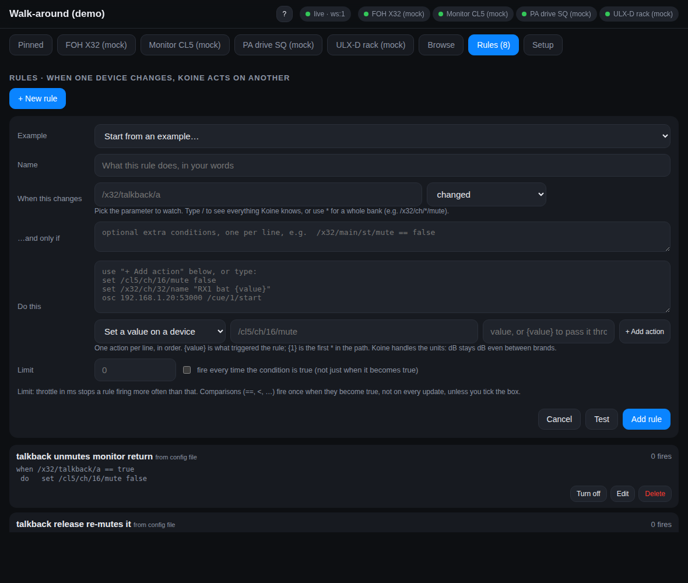

# Koine

**Koine speaks every language on the show network.** It understands a command or a piece of
telemetry from one device and delivers it to a foreign device, in that device's own dialect.

A Behringer talkback button unmutes a channel on a Yamaha. A spare fader on a Midas trims the
gain on a Shure receiver, and the receiver's battery level is painted onto the Midas scribble
strip in red when it gets low. None of the devices know the others exist. Koine sits in the
middle on a laptop or Raspberry Pi and does the talking.

Koine is named after the common Greek that let the whole ancient Mediterranean trade with one
another. It is zero-dependency Node.js: copy the folder, run `node`, nothing to install.

```
                 ┌──────────────────────────── Koine ────────────────────────────┐
 X32 / M32 ─OSC─▶│                                                               │◀─OSC/UDP─ TouchOSC, QLab, Companion
 Yamaha ───SCP──▶│  profiles ─▶ shadow state (one language) ─▶ rules engine       │◀─WebSocket─ iPad walk-around page
 A&H SQ ──MIDI──▶│      ▲                  │                        │             │◀─OSCQuery─ Vezér, Chataigne, browsers
 Shure RX ──TCP─▶│      └──── commands ◀───┘◀────── actions ◀───────┘             │◀─mDNS─ zero-config discovery
                 └───────────────────────────────────────────────────────────────┘
```



## What it does

1. **Profiles** teach Koine a device's language once, in YAML: addresses, scaling curves, names and
   colours, heartbeats and quirks. Shipped: Behringer X32/M32, X Air, Yamaha SCP (CL/QL/TF/DM/Rivage),
   Allen & Heath SQ, Shure ULX-D/QLX-D/AD.
2. **Shadow state** keeps a live copy of every parameter on every device, normalised to one namespace
   and one set of units (dB, booleans for mutes, hex colours). Reconnecting iPads sync instantly from
   the cache instead of hammering console CPUs. Echoes are suppressed, loops are prevented.
3. **Rules** connect devices: *when* something changes on one, *do* something on another. Written in
   the same YAML, with wildcards so one rule can mirror a whole bank.
4. **Northbound APIs** expose the whole thing to anything modern: OSCQuery, WebSocket, plain OSC over
   UDP, REST, mDNS discovery, and a touch-first web page for walking the room.



## Try it in one minute

```bash
cd koine
npm test          # 58 tests, including end-to-end runs against mock X32, Yamaha, SQ and ULX-D
npm run demo      # four mock devices + example rules, UI at http://localhost:8010/ui
```

In the demo the mock consoles move faders, press talkback and report RF battery on their own;
watch the **Rules** tab to see Koine reacting.

## Real hardware

```bash
cp config/daemon.example.yaml config/daemon.yaml   # fill in device IPs, pins and rules
node bin/koine.js start -c config/daemon.yaml
```

```bash
node bin/koine.js status                              # devices, connection state, counters
node bin/koine.js rules                               # rules with fire counts
node bin/koine.js get  /x32/ch/10/fader
node bin/koine.js set  /x32/ch/10/fader -12.5
node bin/koine.js set  /cl5/ch/01/mute true
node bin/koine.js watch "/x32/ch/*/fader"             # stream changes and rule fires
node bin/koine.js validate profiles                   # lint profiles
node bin/koine.js tree profiles/yamaha-scp.yaml "/ch/01/*"
```

## Rules

```yaml
rules:
  - name: talkback unmutes the monitor talkback return
    when: /x32/talkback/a == true
    do: set /cl5/ch/16/mute false

  - name: mirror FOH input mutes onto the monitor desk   # {1} is the wildcard match
    when: /x32/ch/*/mute changed
    do: set /cl5/ch/{1}/mute {value}

  - name: spare FOH fader trims the vocal receiver gain  # dB on the desk -> dB on the receiver
    when: /x32/ch/32/fader changed
    do: { set: /rf/rx/1/gain, scale: { type: linear, raw: [-90, 10], value: [-18, 42] } }

  - name: receiver battery painted onto the FOH scribble strip
    when: /rf/rx/1/battery/bars changed
    do: set /x32/ch/32/name "RX1 bat {value}"

  - name: low battery turns the strip red and fires a QLab cue
    when: /rf/rx/1/battery/bars <= 1
    and: ["/x32/main/st/mute == false"]
    do:
      - set /x32/ch/32/color "#ff3b30"
      - osc 192.168.1.20:53000 /cue/lowbatt/start
    throttleMs: 60000
```

| Piece | Meaning |
| --- | --- |
| `when: <path> <op> <literal>` | `== != < <= > >=`; fires on the false→true edge unless `every: true`. `<path> changed` fires on every change. |
| `and: [...]` | extra conditions checked against current state |
| `do:` | one action or a list, run in order: `set <path> <value>`, `osc <host:port> <address> [args]`, `http <url>`, `log <text>`, `wait <ms>`, `resync <device>` |
| `{value} {raw} {path} {device} {1}..{n} {state:/other/path}` | templates; `"{value} + 6"` style arithmetic is evaluated, `!{value}` negates |
| `scale:` on a set | reuse any profile scale to map one device's range onto another's |
| `throttleMs`, `debounceMs`, `enabled`, `onSync` | rate limiting; `onSync: true` also fires during a device's start-up sync (off by default) |

Rules never re-trigger themselves and cascades stop after eight hops, so two mirrored faders cannot
fight forever. Values arriving while a device is still syncing are treated as population, not events.

## Editing from the iPad

Everything you would touch during a show can be changed from the web page, not only from the
YAML on the host:

- **Rules**: add, test, edit, turn off, delete. The Test button shows which paths a `when` matches
  before you save it. Multi-line `do` boxes take one action per line.
- **Pinned page**: Edit pins, add by path (with autocomplete over every known parameter), reorder,
  remove.
- **Devices**: Setup tab lists every device with its connection state; add a console by id,
  profile, IP and optional include patterns, or remove one that was added this way.

Edits are saved to a store file on the Koine host (`<config>.store.json`, or `--store <file>`) and
merged on top of the YAML at start-up, so the YAML keeps its comments and the edits survive restarts.
Every connected screen is told about a change the moment it happens. A rule that came from the YAML
and is edited on the iPad becomes a store rule that shadows the original.

The same operations are available over REST for anything else that wants to program Koine:

| | |
| --- | --- |
| `GET /api/rules`, `POST /api/rules`, `PUT /api/rules/:id`, `DELETE /api/rules/:id` | manage rules |
| `POST /api/rules/test` | dry-run a rule: parse errors and matching paths |
| `POST /api/rules/:id/enable` `{"enabled": false}` | switch a rule on or off |
| `GET /api/ui`, `PUT /api/ui` `{"pins": [...], "title": ...}` | the pinned page |
| `GET /api/devices`, `POST /api/devices`, `DELETE /api/devices/:id` | devices |
| `GET /api/paths` | every parameter with type, unit, range and role (for pickers) |



## Network behaviour

Koine is designed to be a polite guest on a show network that also carries Dante, console
control and lighting. What it puts on the wire, exactly:

| Direction | Traffic | Bounds |
| --- | --- | --- |
| To each device | unicast only, to the IP you configured, on that vendor's control port | writes coalesced per parameter (default 1 per 15 ms, last value wins); device-wide cap `maxTxPerSec` (default 400); start-up sync paced by `queryRateLimit` |
| Keepalives | X32 `/xremote` every 8 s, `/xinfo` every 3 s; Yamaha `devstatus` every 5 s; SQ poll every 5 s | a few packets per second per device, constant, tiny |
| Reconnects | TCP reconnects back off 2 s → 4 s → … → 30 s while a device is unreachable; UDP pings every 2 s | never hammers a console that is rebooting |
| From clients | HTTP/WebSocket on one TCP port, OSC on one UDP port | shadow updates batched every 8 ms; UDP subscriptions expire after 60 s without renewal; request bodies capped at 1 MB |
| Discovery | mDNS on 224.0.0.251 announcing `_oscjson._tcp` and `_osc._udp` | 3 announcements at start, then one per minute; answers only queries for its own names. `mdns: false` turns it off entirely |

Koine never scans the network, never broadcasts, never sends multicast other than the optional mDNS
announcement, never opens a connection it was not configured to open, and never speaks to a Dante
device (audio routing stays with Dante Controller or your own tools). Bind the northbound ports to a
specific interface with `daemon.http.host` / `daemon.osc.host` so the iPad side lives on the control
VLAN and nothing is exposed on the Dante VLAN.

Ports to allow on a managed switch or firewall:

| Port | Protocol | Purpose |
| --- | --- | --- |
| 8010/tcp (configurable) | HTTP + WebSocket | OSCQuery, REST, the web page |
| 9000/udp (configurable) | OSC | TouchOSC / QLab / Companion |
| 5353/udp multicast | mDNS | optional discovery |
| 10023/udp, 10024/udp | OSC | X32/M32, X Air |
| 49280/tcp | SCP | Yamaha |
| 51325/tcp | MIDI over TCP | Allen & Heath |
| 2202/tcp | command strings | Shure receivers |

There is no authentication on the northbound API yet: anyone who can reach the page can move a fader.
Run it on the isolated control network, not on venue guest Wi-Fi.

## At the gig

1. Plug the Koine host into the control VLAN. Start it: `node bin/koine.js start -c config/daemon.yaml`
   (or `npm run demo` with no gear, to show someone what it does).
2. On the iPad, open `http://<host-ip>:8010/ui`. Add it to the home screen; it runs full-screen.
3. **Setup** tab: add each device by brand and IP. Green dot means Koine is talking to it.
4. **Pinned** tab: Edit pins, add the handful of controls you want with you.
5. **Rules** tab: New rule, pick an example, adjust the paths, Test, Add. It is live immediately.
6. If Wi-Fi drops, the page reconnects on its own and is current within a second, from Koine's cache.

## Normalised namespace

Every device is mounted under its configured id. Paths and units are the same regardless of vendor:

| Path | Type | Unit | Notes |
| --- | --- | --- | --- |
| `/<dev>/ch/NN/fader` | float | dB | X32 fader law, Yamaha 1/100 dB, A&H 14-bit NRPN, all → dB |
| `/<dev>/ch/NN/mute` | bool | | `true` = muted, whatever the vendor's polarity |
| `/<dev>/ch/NN/name` | string | | scribble strip |
| `/<dev>/ch/NN/color` | color | | `#rrggbb`, vendor palettes mapped to hex |
| `/<dev>/ch/NN/pan`, `/hpf/*`, `/eq/B/*`, `/send/BB/level` | | | where the profile defines them |
| `/<dev>/bus|mix|mtx|dca/NN/...`, `/<dev>/main/st|lr|m/...` | | | |
| `/<dev>/out/NN/delay/ms` | float | ms | X32 output delays (front fills) |
| `/<dev>/talkback/a` | bool | | X32 talkback |
| `/<dev>/rx/N/gain`, `/name`, `/mute`, `/battery/bars`, `/battery/minutes`, `/rf/level`, `/audio/level` | | | Shure receivers |
| `/<dev>/scene/current` | int | | read-only |

Each OSCQuery node also carries a `DEVICE` object (`raw`, vendor `address`, `scale`, `source`,
`updated`) and `STALE: true` while the device is offline, so clients can show cached values honestly.

## Northbound protocols

**OSCQuery / HTTP** (port 8010): `GET /` tree, `GET /x32/ch/10/fader?VALUE`, `GET /?HOST_INFO`,
`POST /x32/ch/10/fader` with `{"VALUE":[-12]}`, `GET /ui` or `/?HTML` for the web page.

**WebSocket** (same port): OSCQuery `LISTEN` / `IGNORE` with binary OSC updates, plus JSON commands
`LISTEN_ALL`, `FORMAT json`, `SNAPSHOT`, `SET`, `GET`, `TREE`, `STATUS`, `RULES`, `RESYNC`. Pushes
`DEVICE_STATUS`, `STALE`, `RULE_FIRED`, `CONFIG_CHANGED` and `TREE_CHANGED` events. A client never receives its own writes echoed back.

**OSC over UDP** (port 9000): `/x32/ch/10/fader -12.0` sets, `/x32/ch/10/fader` queries,
`/cl5/ch/0[1-8]/mute T` fans out over patterns, `/koine/listen [pattern]` subscribes the sender for
60 s (`/xremote` is an alias), `/koine/snapshot`, `/koine/resync`.

**REST**: `/api/status`, `/api/devices`, `/api/profiles`, `/api/rules`, `/api/snapshot?prefix=`,
`POST /api/set`, `/api/resync?device=`, `/api/ui`.

**mDNS**: `<name>._oscjson._tcp.local` and `<name>._osc._udp.local`.

## Profiles

```yaml
id: behringer-x32
transport:
  type: osc-udp
  port: 10023
  keepalive: { address: /xremote, intervalMs: 8000 }
  ping: { address: /xinfo, intervalMs: 3000 }
  timeoutMs: 10000
  confirmWrites: true                 # X32 never echoes a write to its sender; re-query when writes settle
ranges:
  ch: { from: 1, to: 32, pad: 2 }
parameters:
  - path: /ch/{ch}/fader              # normalised path ({ch} → 01..32)
    device: /ch/{ch}/mix/fader        # vendor address
    type: float
    unit: dB
    range: [-90, 10]
    deviceType: f
    scale: { type: piecewise, points: [[0, -90], [0.0625, -60], [0.25, -30], [0.5, -10], [1, 10]] }
    role: fader                       # fader | mute | name | color drives generic UIs
```

Placeholders: `{ch}` padded, `{ch0}` zero-based, `{ch1}` unpadded, `{ch:hex}`, `{ch:label}`.
Scales (all bidirectional): `identity`, `int`, `float`, `string{maxLength,trim}`, `bool{invert}`,
`linear{raw,value,rawMinSentinel}`, `piecewise{points,round}`, `log{raw,value}`, `enum{map}`.

| transport | used for | key options |
| --- | --- | --- |
| `osc-udp` | X32/M32, X Air, DiGiCo, any OSC DSP | `keepalive`, `ping`, `timeoutMs`, `onConnect`, `confirmWrites`, `queryRateLimit`, `writeCoalesceMs`, `maxTxPerSec` |
| `tcp-line` | Yamaha SCP, Shure, Q-SYS, any text protocol | `delimiter`, `keepalive.command`, `dialect.{get,set,response,error,resync}` with `key`/`raw` regex groups |
| `midi-tcp` | A&H SQ/dLive/Avantis | `midiChannel`, `poll.intervalMs`, `sysexHeader`; device forms `nrpn`, `note`, `sysex` |

### Hardware status

| Profile | Written from | Checked on hardware |
| --- | --- | --- |
| `behringer-x32` (X32, M32) | X32 OSC protocol document | not yet |
| `behringer-xair` | X Air OSC protocol document | not yet |
| `yamaha-scp` (CL/QL/TF/DM3/DM7/Rivage) | Yamaha remote control protocol documents | not yet |
| `allen-heath-sq` | SQ MIDI protocol document, from memory | not yet, marked `verified: false` |
| `shure-ulxd` | Shure command strings document, from memory | not yet, marked `verified: false` |

All profiles pass round-trip tests against the mock devices in `tools/`. First field test planned:
M32, then DM3, then SQ5.

## Configuration

See `config/daemon.example.yaml`. Per device: `id`, `profile`, `host`, optional `port`, `name`,
`include` / `exclude` OSC patterns (a pattern also matches everything beneath it), and `transport`
overrides. `rules:` inline or `rulesFiles:`. `profilesDir:` for community or venue profiles; a profile
with the same `id` overrides a built-in one. `ui.pins` lists what the walk-around page shows.
`storePath:` (or `--store`) is where UI edits are saved; it defaults to `<config>.store.json`.

## Layout

```
bin/koine.js             CLI: start, demo, validate, tree, get, set, watch, status, rules
src/osc/codec.js         OSC 1.0/1.1 encoder/decoder + address pattern matching
src/util/yaml.js         dependency-free YAML subset parser (uses `yaml`/`js-yaml` if installed)
src/profile/             profile loader/validator, placeholder expansion, scaling engine
src/shadow/state.js      shadow state engine (cache, echo suppression, batching)
src/rules/engine.js      rules engine (conditions, templates, actions, loop guards)
src/drivers/             base, osc-udp, tcp-line, midi-tcp
src/core/                Device (profile+driver+shadow), Daemon (orchestration, live editing), Store (persisted edits)
src/northbound/          ws.js (RFC 6455), oscquery.js (HTTP/WS/REST), osc-server.js (UDP), mdns.js
profiles/                vendor profiles
tools/                   mock X32, Yamaha SCP, A&H SQ, Shure ULX-D (used by tests and `demo`)
ui/index.html            touch-first web UI: pinned page, channel strips, rule editor, device setup
test/                    node:test suites (unit + end-to-end)
```

## Not yet

- Metering as a separate high-rate stream
- Momentary events (console macro presses) and MIDI output for devices that only listen on a DIN port (Avid S6L events)
- DiGiCo, Q-SYS, d&b R1, Meyer Galaxy, Lake, Ember+ and HiQnet profiles
- Authentication on the northbound API (assumes an isolated show network)
