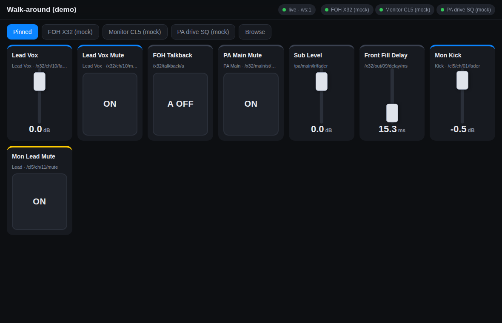
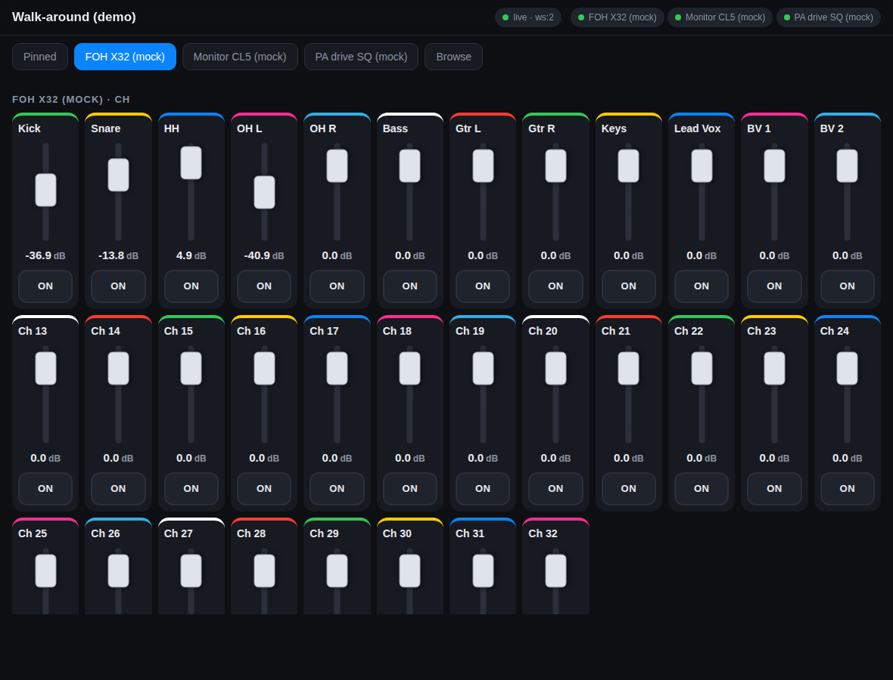

# paad — Headless Pro Audio Translation Daemon

A lightweight, zero-dependency Node.js service that sits between mixing consoles / DSPs and modern
control surfaces. It speaks each vendor's dialect southbound (Behringer/Midas OSC over UDP, Yamaha
SCP over TCP, Allen & Heath MIDI over TCP), keeps a continuous **shadow state** of every parameter,
and exposes one normalized, self-describing namespace northbound via **OSCQuery**, **WebSocket**,
plain **OSC/UDP** and **REST**, advertised with **mDNS** (`_oscjson._tcp`).

```
 TouchOSC / QLab / Companion ──OSC UDP 9000──┐                       ┌── osc-udp ──▶ X32 / M32 / X Air (10023/10024)
 iPad web UI / Stream Deck  ──WebSocket 8010─┤   paad (FOH PC / Pi)  ├── tcp-line ─▶ Yamaha CL/QL/TF/Rivage/DM (49280)
 OSCQuery browsers (Vezér…) ──HTTP 8010──────┤   shadow state engine ├── midi-tcp ─▶ Allen & Heath SQ / dLive (51325)
 mDNS discovery `_oscjson._tcp` ─────────────┘                       └── (add a YAML profile for anything else)
```

Runs on Node ≥ 18 with no `npm install` required.



## Why

Live control protocols are fragmented and every OSC implementation invents its own addressing,
scaling and query semantics. Controllers end up hard-coded with obscure path strings from 40-page
PDFs, and iPads on venue Wi-Fi drop UDP sockets and take seconds to resync. paad fixes this with:

1. **Declarative driver profiles** (`profiles/*.yaml`): address maps, regex extractors, scaling curves,
   parameter metadata and vendor quirks (X32 `/xremote` heartbeats, Yamaha `devstatus` keepalives,
   A&H query polling) in data, not code. Community-editable.
2. **In-memory shadow state**: the local cache answers reconnecting clients in milliseconds without
   flooding the console CPU, with echo suppression and loop prevention for bidirectional writes.
3. **Standard northbound API**: OSCQuery JSON tree with `TYPE`, `RANGE`, `UNIT`, `ACCESS`,
   `DESCRIPTION`, scribble-strip names/colours, live `LISTEN` over WebSocket, and a normalized OSC
   dialect for legacy clients.

## Quick start

```bash
cd pro-audio-daemon
npm test                 # 39 tests incl. end-to-end against mock X32 / Yamaha / SQ consoles
npm run demo             # starts three mock consoles + the daemon on http://localhost:8010
```

Open <http://localhost:8010/ui> for the walk-around UI, <http://localhost:8010/?HOST_INFO> for OSCQuery
host info, <http://localhost:8010/x32/ch/10/fader> for a parameter node.

Real hardware:

```bash
cp config/daemon.example.yaml config/daemon.yaml   # edit device hosts / pins
node bin/paad.js start -c config/daemon.yaml
```

CLI helpers (against a running daemon):

```bash
node bin/paad.js status
node bin/paad.js get  /x32/ch/10/fader
node bin/paad.js set  /x32/ch/10/fader -12.5
node bin/paad.js set  /cl5/ch/01/mute true
node bin/paad.js watch "/x32/ch/*/fader"          # stream changes
node bin/paad.js validate profiles                # lint profiles
node bin/paad.js tree profiles/yamaha-scp.yaml "/ch/01/*"
```

## Normalized namespace

Every device is mounted under its configured id. Paths and units are the same regardless of vendor:

| Path | Type | Unit | Notes |
| --- | --- | --- | --- |
| `/<dev>/ch/NN/fader` | float | dB | X32 fader law, Yamaha 1/100 dB, A&H 14-bit NRPN all → dB |
| `/<dev>/ch/NN/mute` | bool | | `true` = muted, regardless of vendor "on" polarity |
| `/<dev>/ch/NN/name` | string | | scribble strip |
| `/<dev>/ch/NN/color` | color | | `#rrggbb`, vendor palettes mapped to hex |
| `/<dev>/ch/NN/pan`, `/hpf/*`, `/eq/B/*`, `/send/BB/level` | | | where the profile defines them |
| `/<dev>/bus|mix|mtx|dca/NN/...`, `/<dev>/main/st|lr|m/...` | | | |
| `/<dev>/out/NN/delay/ms` | float | ms | X32 output delays (front fills) |
| `/<dev>/talkback/a` | bool | | X32 talkback |
| `/<dev>/scene/current` | int | | read-only |

Each OSCQuery node also carries a non-standard `DEVICE` object (`raw`, `address`, `scale`, `source`,
`updated`) and `STALE: true` while the console is offline, so clients can show cached-but-unconfirmed values.

## Northbound protocols

### OSCQuery (HTTP, port 8010)

* `GET /` full tree; `GET /x32/ch/10` subtree; `GET /x32/ch/10/fader?VALUE` single attribute
* `GET /?HOST_INFO` → `NAME`, `EXTENSIONS`, `OSC_PORT`, `OSC_TRANSPORT`, `WS_PORT`
* `POST /x32/ch/10/fader` with `{"VALUE":[-12]}` sets a value
* `GET /?HTML` or `/ui` → the walk-around UI

### WebSocket (same port)

Standard OSCQuery commands, plus a JSON control protocol:

```jsonc
{"COMMAND":"LISTEN","DATA":"/x32/ch/10/fader"}      // cached value now, then live updates (binary OSC frames)
{"COMMAND":"LISTEN","DATA":"/cl5/ch/*/mute"}         // patterns and prefixes ("/x32/") are accepted
{"COMMAND":"IGNORE","DATA":"/x32/ch/10/fader"}
{"COMMAND":"LISTEN_ALL"}
{"COMMAND":"FORMAT","DATA":"json"}                   // updates as {"COMMAND":"VALUES","DATA":[{path,value,ts,source,stale}]}
{"COMMAND":"SNAPSHOT","DATA":"/x32"}                  // full cache dump for instant resync
{"COMMAND":"SET","DATA":{"path":"/x32/ch/10/fader","value":-12},"ID":1}   // -> ACK
{"COMMAND":"GET","DATA":["/x32/ch/10/fader"]}
{"COMMAND":"TREE","DATA":"/"}  {"COMMAND":"STATUS"}  {"COMMAND":"RESYNC","DATA":"x32"}
```

Binary frames are plain OSC: a message with arguments sets, without arguments queries. The server
never echoes a client's own writes back to it, and pushes `DEVICE_STATUS` / `STALE` events.

### OSC over UDP (port 9000)

```
/x32/ch/10/fader -12.0           set (float dB)
/x32/ch/10/fader                 query → reply to sender
/cl5/ch/0[1-8]/mute T            OSC patterns fan out
/paad/listen [/x32/ch/*/fader]   subscribe the sender for 60 s (re-send to keep alive; /xremote is an alias)
/paad/snapshot [/prefix]         bundle of all values
/paad/resync [deviceId]
```

### REST

`GET /api/status`, `GET /api/devices`, `GET /api/profiles`, `GET /api/snapshot?prefix=/x32`,
`POST /api/set` with `{path,value}` or an array, `GET /api/resync?device=x32`, `GET /api/ui`.

## Shadow state semantics

* **Optimistic writes**: a client set updates the cache immediately and is broadcast to other clients
  with `source` = the writer's id; the write is marked *pending* until the device confirms it.
* **Echo suppression**: when the console echoes the same value (Yamaha `OK set`, X32 change
  notification, or paad's own debounced confirmation query for consoles that never echo to the
  sender) the update is recognized as an echo and **not** re-broadcast as a change.
* **Device wins**: if the console replies with a different value inside the echo window (it clamped
  or rejected the write), the cache takes the device value and clients are corrected.
* **Loop prevention**: device-originated changes are never written back; client writes equal to the
  current value are no-ops.
* **Batching**: changes are coalesced per `batchMs` (default 8 ms ≈ 120 Hz) so 60 fps fader moves
  stay smooth without flooding slow Wi-Fi clients.
* **Staleness**: on disconnect all of a device's nodes are flagged stale but keep their last value;
  on reconnect a rate-limited full sync (`queryRateLimit`) refreshes them.

## Driver profiles

Profiles are YAML (a JSON file works too). A parameter is one entry, expanded over `ranges`:

```yaml
id: behringer-x32
transport:
  type: osc-udp
  port: 10023
  keepalive: { address: /xremote, intervalMs: 8000 }
  ping: { address: /xinfo, intervalMs: 3000 }
  timeoutMs: 10000
  confirmWrites: true
ranges:
  ch: { from: 1, to: 32, pad: 2 }
parameters:
  - path: /ch/{ch}/fader              # normalized path ({ch} → 01..32)
    device: /ch/{ch}/mix/fader        # vendor address
    type: float
    unit: dB
    range: [-90, 10]
    deviceType: f
    scale: { type: piecewise, points: [[0, -90], [0.0625, -60], [0.25, -30], [0.5, -10], [1, 10]] }
    role: fader                       # fader | mute | name | color → drives generic UIs
    description: Channel {ch} fader level
```

Placeholders: `{ch}` padded 1-based, `{ch0}` zero-based, `{ch1}` unpadded 1-based, `{ch:hex}`, `{ch:label}`.

Scale types: `identity`, `int`, `float`, `string{maxLength}`, `bool{invert}`, `linear{raw,value,rawMinSentinel}`,
`piecewise{points,round}`, `log{raw,value}`, `enum{map}`. All are bidirectional.

Transports:

| type | used for | key options |
| --- | --- | --- |
| `osc-udp` | X32/M32, X Air, any OSC DSP | `keepalive`, `ping`, `timeoutMs`, `onConnect`, `confirmWrites`, `queryRateLimit` |
| `tcp-line` | Yamaha SCP, text protocols | `delimiter`, `keepalive.command`, `dialect.{get,set,response,error,resync}` (regex with `key`/`raw` groups) |
| `midi-tcp` | A&H SQ/dLive/Avantis | `midiChannel`, `poll.intervalMs`, `sysexHeader`; device forms `nrpn`, `note`, `sysex` |

Shipped profiles: `behringer-x32`, `behringer-xair`, `yamaha-scp` (written from the published protocol
documents and exercised against the included mocks) and `allen-heath-sq` (marked `verified: false`:
parameter numbers follow the SQ MIDI protocol document but have not been checked on hardware). None of
the profiles has been validated against physical consoles yet. Drop additional profiles in a directory and
point `profilesDir` at it; a profile with the same `id` overrides a built-in one.

## Configuration

See `config/daemon.example.yaml`. Per device: `id`, `profile`, `host`, optional `port`, `name`,
`include` / `exclude` OSC patterns to trim the namespace (a pattern also matches everything beneath it),
and `transport` overrides. `ui.pins` lists the parameters shown on the walk-around page.



## Layout

```
bin/paad.js              CLI: start, demo, validate, tree, get, set, watch, status
src/osc/codec.js         OSC 1.0/1.1 encoder/decoder + address pattern matching
src/util/yaml.js         dependency-free YAML subset parser (uses `yaml`/`js-yaml` if installed)
src/profile/             profile loader/validator, placeholder expansion, scaling engine
src/shadow/state.js      shadow state engine (cache, echo suppression, batching)
src/drivers/             base, osc-udp, tcp-line, midi-tcp
src/core/                Device (profile+driver+shadow) and Daemon (orchestration)
src/northbound/          ws.js (RFC 6455), oscquery.js (HTTP/WS/REST), osc-server.js (UDP), mdns.js
profiles/                vendor profiles
tools/                   mock-x32, mock-scp, mock-sq consoles (also used by tests and `demo`)
ui/index.html            touch-first walk-around web UI
test/                    node:test suites
```

## Roadmap / not yet implemented

* Metering (`/meters` blobs on X32, Yamaha `MIXER:Current/...Meter`) as a separate high-rate stream
* DiGiCo (OSC), Midas Pro/Heritage, QSC Q-SYS QRC, Lake/LM, Powersoft profiles
* OSCQuery `PATH_ADDED/REMOVED` when devices are added at runtime
* Authentication for the northbound API (assume an isolated show network today)
